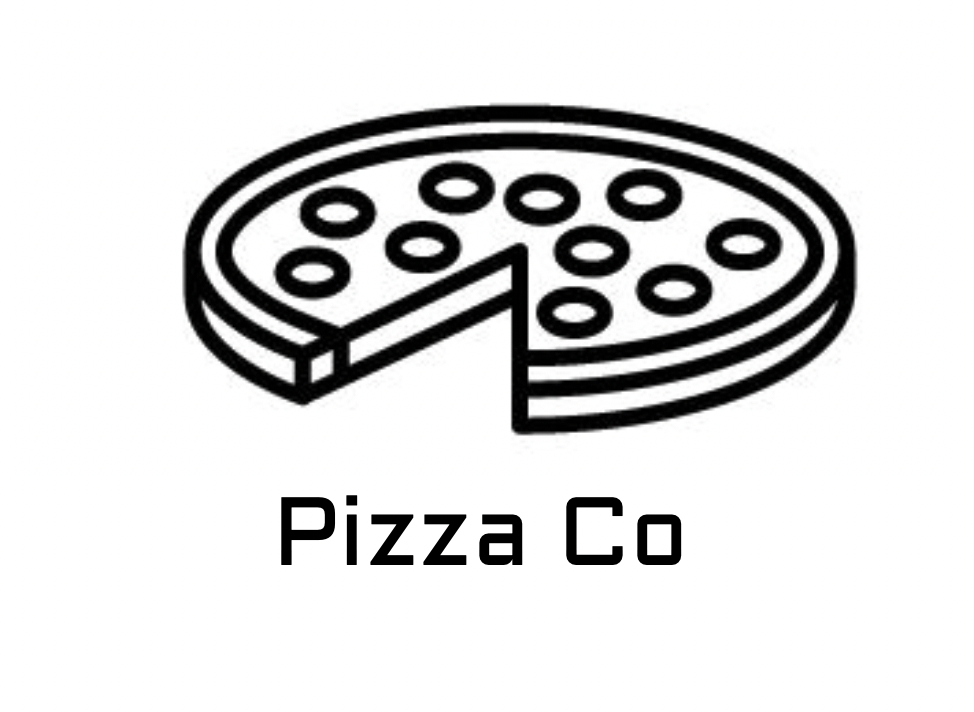
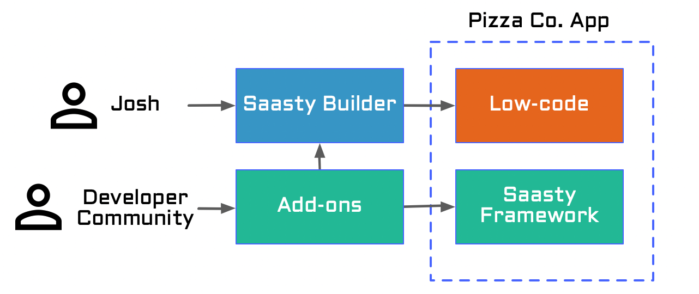
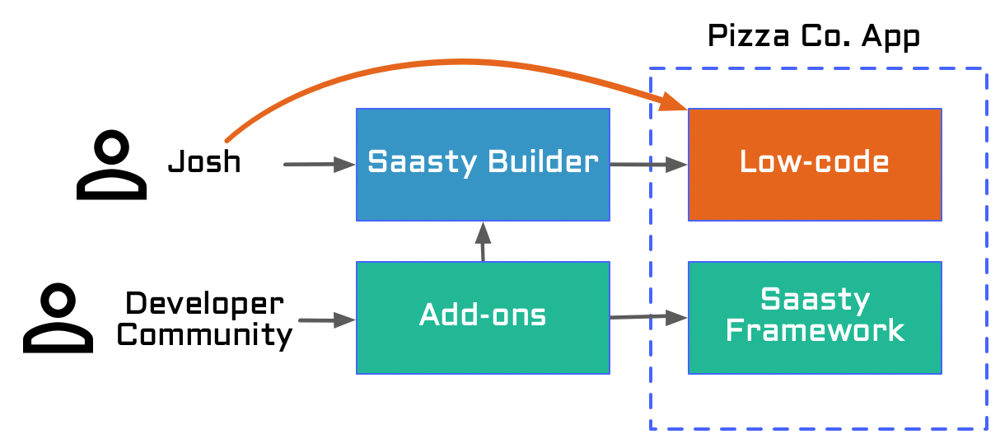
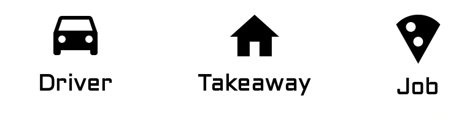

# Building app for Pizza Co with Saasty

In this tutorial I will be building a very bare-bones
on-line application with Saasty for the following scenario:

> Pizza Co. is a global franchise company specialising in
> takeout Pizza. There are 300 takeaways across the country and
> each is a separate business. 
> 
> There is no agreed way how deliveries are handled, each branch
> hire some people.
> 
> Josh is working at Pizza Co HQ. Today he is taking a break
> from his daily routine, to come up with a better way to
> handle deliveries.
> 
> Josh has this interesting idea - allow drivers to sign-up
> and be notified when Pizza needs delivering. Then drivers
> could accept the job and deliver pizza from takeaway to
> the customer for a fee calculated based on delivery distance.

Although Josh from this scenario is not a developer, with Saasty
and bit of patience he can put together a fully working solution
for his idea.

## Builder vs Code

Saasty apps are built using an open-source framework foundation maintained by developer community. Additionally community-maintained add-ons can help in a more specific scenarios.

To make things simpler for Josh, he can simply use **Saasty Builder** to make use of Add-ons and generate his applicaiton code. If Saasty builder does not support certain feature - Josh has an option implement that feature directly - in the **Low-code**.

This tutorial can be completed by either performing steps in Saasty Builder or by writing a code in IDE of your choice. If you begin with the Builder, you can download the code and continue in IDE at any time.

## Application Specification

Lets spend a bit more time describing application we are looking to build. We will deal with 3 types of objects in our applications - Drivers, Jobs and Clients. Each of those 3 objects has some properties and could be linked to each-other.

### Data Model

|        | Driver                  | Takeaway                  | Job                           |
| ------ | ----------------------- | ------------------------- | ----------------------------- |
| Fields | Name, Phone Number      | Address, Phone Number     | Delivery Address, Status, Pay |
| Notes  | Is a user (role=driver) | Is a user (role=takeaway) |                               |
| Links  | has "Current Job"       |                           | has "Takeway" and "Driver"    |

### Actions

Thinking logically through the steps, they would be:

1. Takeway logs into the app
2. Takeway create new Job (status=looking_for_driver)
3. Driver logs into the app
4. Driver looks through jobs (status=looking_for_driver)
5. Driver accepts a job (status becomes "accepted")
6. Driver makes collection (updates status "collected")
7. Driver completes delivery (updates status "delivered")

Once delivery is complete, driver earns extra amount specified in Job.Pay.

### User Interface

Now that we know what actions can be performed on the objects, lets think about presentation. So far we have identified that our app will need two interfaces:

- Takeaway interface
  - allowing to see all jobs and post new
  - generate per-driver reports
- Driver interface
  - look at available jobs, accept a job and 
  - update status of a current job

### Add-ons

To make our application a bit more usable, we can also make use of several add-ons:

- Payments - integration with a payment gateway to automate driver pay-outs.
- Google Locations - allow a better address entry and also pre-calculate distance-based Pay for new jobs.
- Outbox - sends template-based notifications to participants.

### APIs

It may be more convenient for delivery drivers to use a dedicated app, capable of showing the route, navigation etc. Our tutorial does not cover such app, but Josh would need to create API that can be used by such an app.

- /driver/job - list and accept jobs
- /driver/current_job - change status on a current job

# Implementation steps

1. Create a new App
2. Create Data Model (Driver, Takeaway, Job)
3. Create User Interface for Driver and Takeaway
4. Add actions and set up Access Control
5. Integrating Add-ons

